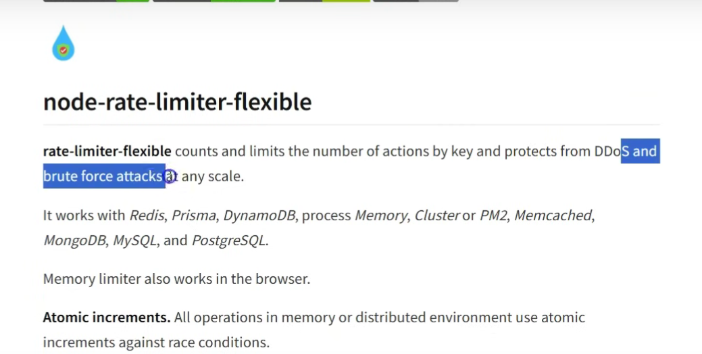

How They Work Together
The API Gateway serves as the "traffic cop" that directs client requests to the appropriate microservice, applies security and rate-limiting, and aggregates responses. Here’s a step-by-step explanation of how they interact:

API Gateway Handles Cross-Cutting Concerns
Before forwarding the request, the API Gateway applies centralized logic for:

Authentication: Checks if the request includes a valid JWT (e.g., in the Authorization header) for protected routes like /api/posts. It may call the Auth microservice’s /refresh-token endpoint (port 3001) to validate or refresh tokens.
Rate-Limiting: Enforces limits on requests per client IP, similar to the RateLimiterRedis and sensitiveEndpointsLimiter in your server.js. For example, it might limit clients to 10 requests per second across all services.
Logging: Logs request details (method, URL, IP, etc.), similar to your logger.js middleware in server.js.
Security: Applies headers (like helmet) and CORS policies, as seen in your server.js.
Request Transformation: Modifies request payloads if needed (e.g., adding metadata or reformatting data).
Validation: Optionally validates request schemas before routing (similar to your validation.js).

Example: For a POST /api/posts request:

The API Gateway checks the JWT by calling the Auth microservice (http://localhost:3001/api/auth/validate-token or verifying the token locally).
If valid, it forwards the request to the Post microservice (http://localhost:3002/api/posts).
If invalid, it returns a 401 Unauthorized response.

3. Routing to the Appropriate Microservice
   The API Gateway uses routing rules to forward requests:

Auth Requests (/api/auth/\*): Forwarded to the Auth microservice on http://localhost:3001. For example:

POST /api/auth/register → http://localhost:3001/api/auth/register
POST /api/auth/login → http://localhost:3001/api/auth/login
POST /api/auth/refresh-token → http://localhost:3001/api/auth/refresh-token
POST /api/auth/logout → http://localhost:3001/api/auth/logout

Post Requests (/api/posts/\*): Forwarded to the Post microservice on http://localhost:3002. For example:

POST /api/posts → http://localhost:3002/api/posts
GET /api/posts/:id → http://localhost:3002/api/posts/:id

The routing is configured in the API Gateway (e.g., using Nginx, Kong, or a custom Express server). Your auth.route.js already defines routes for the Auth microservice, and the Post microservice would have similar routing logic.
